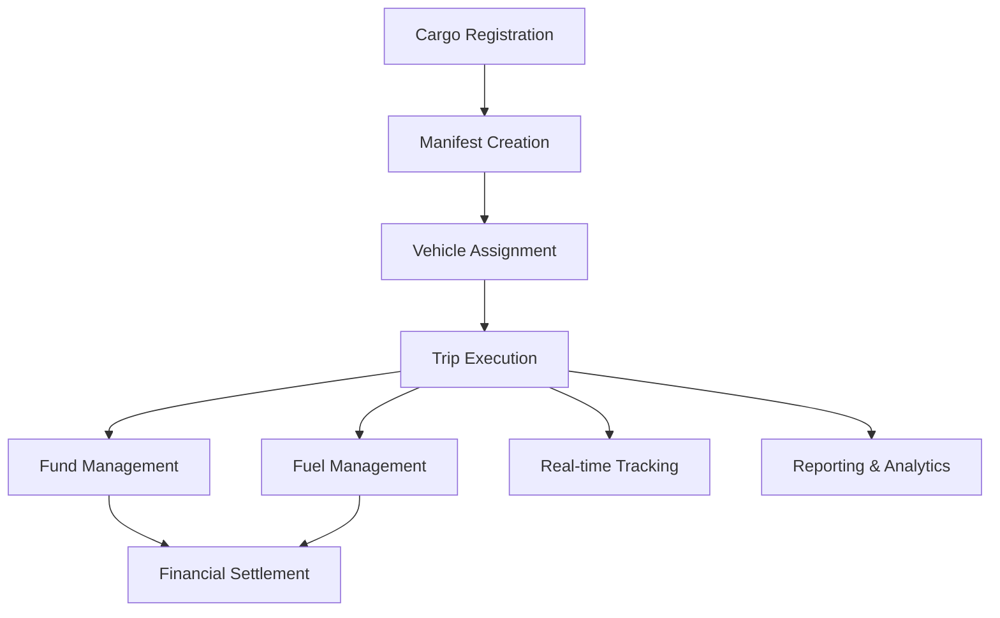

# VSD Fleet Management System

[](https://www.gnu.org/licenses/gpl-3.0)
[](https://erpnext.com/)
[](https://www.python.org/)
[](https://frappeframework.com/)

> **Enterprise-Grade Fleet Management Powered by ERPNext**

A comprehensive, open-source fleet management solution built on the Frappe framework, designed for transportation companies, logistics providers, and organizations managing vehicle fleets. Streamline operations from cargo registration to trip completion with integrated financial management and real-time tracking.

**📝 Note**: This is a community fork of the original [VVSD-LTD/vsd_fleet_ms](https://github.com/VVSD-LTD/vsd_fleet_ms) project, enhanced with comprehensive documentation and additional features based on real customer needs. The original project was built by VVSD-LTD after studying SAP's fleet management solutions, making it one of the most sophisticated fleet management applications in the ERPNext ecosystem.

---

## 🚀 Why Choose VSD Fleet MS?

### **Complete Fleet Lifecycle Management**
- **Cargo Registration** → **Vehicle Assignment** → **Trip Execution** → **Financial Settlement**
- End-to-end workflow automation with approval processes
- Multi-currency support (USD/TZS) with automatic exchange rate handling
- Integrated accounting with ERPNext Journal Entries and Purchase Orders

### **Professional Features**
- **Real-time Trip Tracking** with location updates and GPS integration
- **Intelligent Vehicle Assignment** with trailer management
- **Automated Financial Workflows** for fund and fuel approval
- **Breakdown Management** with trip reassignment capabilities
- **Comprehensive Reporting** with expense analysis and fuel tracking

### **Enterprise Integration**
- **ERPNext Native** - Seamless integration with existing ERP systems
- **Multi-Company Support** - Manage multiple business entities
- **Role-Based Access** - Granular permissions and approval workflows
- **Audit Trail** - Complete transaction history and compliance tracking

---

## 📊 System Architecture



---

## 🛠️ Core Modules

### **Master Data Management**
- **Vehicle Registry** - Complete truck and trailer specifications
- **Driver Management** - Driver profiles with document management
- **Route Configuration** - Predefined routes with distance and fuel calculations
- **Expense Templates** - Standardized cost structures per route

### **Transaction Processing**
- **Cargo Registration** - Customer service entry with invoice generation
- **Manifest Management** - Vehicle-cargo assignment with trailer support
- **Trip Execution** - Complete journey management with 7 specialized tabs
- **Financial Workflows** - Fund approval and fuel procurement processes

### **Operational Intelligence**
- **Real-time Tracking** - GPS integration with location updates
- **Breakdown Management** - Trip interruption handling and reassignment
- **Performance Analytics** - Fuel efficiency and cost analysis
- **Compliance Reporting** - Regulatory and audit trail management

---

## 🎯 Target Users

### **Transportation Companies**
- **Logistics Providers** - Complete cargo-to-delivery management
- **Fleet Operators** - Vehicle and driver optimization
- **Cross-Border Transport** - International route management

### **Enterprise Organizations**
- **Manufacturing Companies** - In-house fleet management
- **Distribution Centers** - Delivery fleet optimization
- **Service Companies** - Field service vehicle management

---

## 🚀 Quick Start

### **1. Installation**
```bash
# Install on existing ERPNext system
bench get-app https://github.com/nelsonmpanju/Fleet-Management-System.git
bench --site [your-site] install-app vsd_fleet_ms
```

### **2. Configuration**
- Set up Transport Settings with fuel items and warehouses
- Configure accounting dimensions for financial tracking
- Define master data (trucks, drivers, routes, expenses)

### **3. First Trip**
- Register customer cargo with service details
- Create manifest and assign vehicles
- Generate trip with automatic expense allocation
- Execute trip with real-time tracking

---

## 📚 Documentation

### **Getting Started**
- **[Complete Workflow Guide](https://nelsonmpanju.github.io/Fleet-Management-System/user-guide/complete-workflow/)** - End-to-end process documentation
- **[API Reference](https://nelsonmpanju.github.io/Fleet-Management-System/api/doctype-reference/)** - Complete technical documentation
- **[Installation Guide](https://nelsonmpanju.github.io/Fleet-Management-System/installation/)** - Detailed setup instructions

### **Core Operations**
- **[Cargo Registration](https://nelsonmpanju.github.io/Fleet-Management-System/transactions/cargo-registration/)** - Customer service management
- **[Manifest Management](https://nelsonmpanju.github.io/Fleet-Management-System/transactions/manifest-management/)** - Vehicle assignment workflow
- **[Trip Management](https://nelsonmpanju.github.io/Fleet-Management-System/transactions/trip-management/)** - Transportation execution
- **[Financial Workflows](https://nelsonmpanju.github.io/Fleet-Management-System/transactions/financial-workflows/)** - Fund and fuel management

### **Technical Reference**
- **[API Reference](https://nelsonmpanju.github.io/Fleet-Management-System/api/doctype-reference/)** - Complete doctype specifications
- **[Setup Guides](https://nelsonmpanju.github.io/Fleet-Management-System/setup/)** - Master data and system configuration

---

## 🔧 Technology Stack

- **Framework**: Frappe/ERPNext v15+
- **Database**: MariaDB/MySQL
- **Frontend**: Frappe UI with Material Design
- **Backend**: Python 3.10+
- **Integration**: REST APIs, Webhooks, ERPNext native

---

## 🌟 Key Differentiators

### **ERPNext Native**
Unlike standalone fleet management systems, VSD Fleet MS is built natively on ERPNext, providing:
- **Unified Data Model** - Single source of truth for all business data
- **Integrated Financials** - Seamless accounting and reporting
- **Extensible Architecture** - Easy customization and integration

### **Professional Workflows**
- **Approval-Based Operations** - Multi-level approval for funds and fuel
- **Status-Driven Processes** - Clear progression through trip lifecycle
- **Exception Handling** - Breakdown management and trip reassignment

### **Enterprise Features**
- **Multi-Currency Support** - USD/TZS with automatic exchange rates
- **Accounting Dimensions** - Granular cost tracking and analysis
- **Audit Compliance** - Complete transaction history and trail

---

## 📈 Business Benefits

### **Operational Efficiency**
- **Reduced Manual Work** - Automated workflows and calculations
- **Faster Processing** - Streamlined approval and execution processes
- **Better Resource Utilization** - Optimized vehicle and driver assignment

### **Financial Control**
- **Cost Transparency** - Detailed expense tracking and analysis
- **Approval Workflows** - Controlled spending with multi-level approvals
- **Real-time Reporting** - Instant visibility into fleet performance

### **Compliance & Risk Management**
- **Audit Trail** - Complete transaction history for compliance
- **Document Management** - Centralized storage of all fleet documents
- **Exception Handling** - Proper management of breakdowns and delays

---

## 🤝 Contributing

We welcome contributions from the community! Whether you're a developer, business analyst, or fleet management expert, there are many ways to contribute:

### **Development**
- **Bug Reports** - Help improve system stability
- **Feature Requests** - Suggest new capabilities
- **Code Contributions** - Enhance functionality
- **Documentation** - Improve user guides and technical docs

### **Business Expertise**
- **Workflow Optimization** - Suggest process improvements
- **Industry Knowledge** - Share transportation best practices
- **User Testing** - Provide feedback on usability
- **Case Studies** - Document successful implementations

### **Getting Started**
1. **Fork** the repository on GitHub
2. **Create** a feature branch for your contribution
3. **Develop** your changes following our guidelines
4. **Test** thoroughly on a development environment
5. **Submit** a pull request with detailed description

For detailed contribution guidelines, see our **[Contributing Guide](https://nelsonmpanju.github.io/Fleet-Management-System/contributing/)**.

---

## 📞 Support & Community

### **Documentation**
- **User Guides** - Step-by-step instructions for all features
- **API Reference** - Complete technical documentation
- **Video Tutorials** - Visual learning resources

### **Community Support**
- **GitHub Issues** - Bug reports and feature requests
- **Discussions** - Community forum for questions and ideas
- **Contributions** - Code, documentation, and testing

### **Professional Support**
- **Email Support** - nelsonnorbert87@gmail.com
- **Implementation Services** - Custom setup and training
- **Consulting** - Workflow optimization and customization

---

## 📄 License

This project is licensed under the **GNU General Public License v3.0** - see the [LICENSE](../license.txt) file for details.

---

## 🙏 Acknowledgments

### **Original Development**
- **[VVSD-LTD](https://github.com/VVSD-LTD)** - Original creators of the VSD Fleet Management System
- **SAP Research** - Inspiration and best practices from SAP's fleet management solutions
- **ERPNext Community** - Framework and ecosystem support

### **Community Contributions**
- **Documentation** - Comprehensive guides and technical references
- **Feature Enhancements** - Customer-driven improvements
- **Testing & Feedback** - Quality assurance and user experience improvements

---

<div align="center">

**Ready to transform your fleet operations?**

[🚀 Get Started](https://nelsonmpanju.github.io/Fleet-Management-System/user-guide/complete-workflow/) • [📖 Documentation](https://nelsonmpanju.github.io/Fleet-Management-System/) • [🤝 Contribute](https://github.com/nelsonmpanju/Fleet-Management-System)

**Forked from [VVSD-LTD/vsd_fleet_ms](https://github.com/VVSD-LTD/vsd_fleet_ms) with enhanced documentation and features**

</div>
