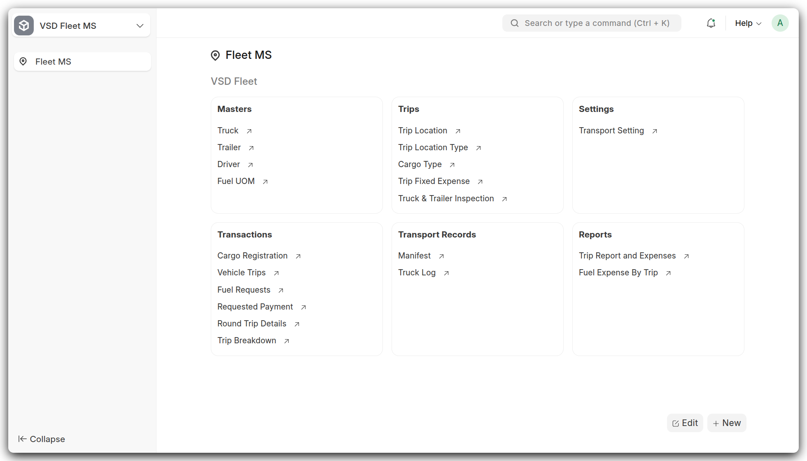

# Installation Guide

This guide will walk you through the process of installing and setting up the VSD Fleet Management System.

{ width="100%" }

*The VSD Fleet Management System provides a comprehensive workspace for managing fleet operations after successful installation and configuration.*

## Prerequisites

- Frappe/ERPNext environment (Version 15 or later)
- Python 3.10+
- Git

## Installation Steps

1. Change to your bench directory:
   ```bash
   cd frappe-bench
   ```

2. Get the app from GitHub:
   ```bash
   bench get-app vsd_fleet_ms https://github.com/nelsonmpanju/Fleet-Management-System.git
   ```

3. Install the app on your site:
   ```bash
   bench --site your-site.local install-app vsd_fleet_ms
   ```

4. Run migrations (if any):
   ```bash
   bench --site your-site.local migrate
   ```

## Configuration

After installation, you'll need to:

1. Set up basic configurations through ERPNext settings
2. Configure GPS tracking settings (if using this feature)
3. Set up user permissions and roles
4. Configure email notifications (optional)

## Verification

To verify the installation:

1. Login to your ERPNext site
2. Look for "VSD Fleet MS" in the modules list
3. Try creating a new vehicle record

## Troubleshooting

If you encounter any issues during installation:

1. Check the bench logs:
   ```bash
   bench logs
   ```

2. Ensure all dependencies are installed:
   ```bash
   pip install -r requirements.txt
   ```

3. Clear cache and rebuild:
   ```bash
   bench clear-cache
   bench build
   ```

For additional help, please refer to our support section or raise an issue on GitHub. 