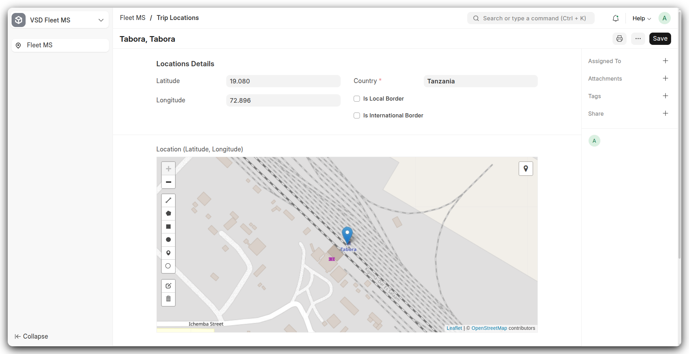
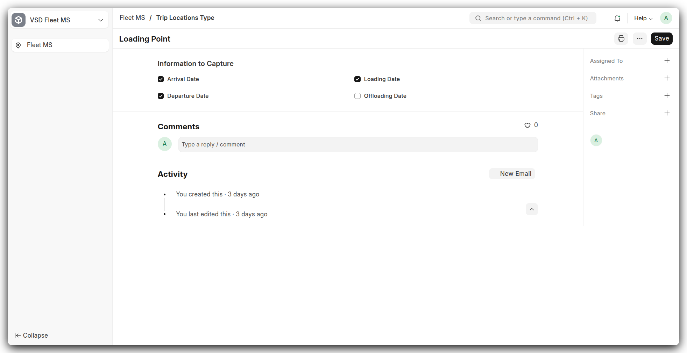
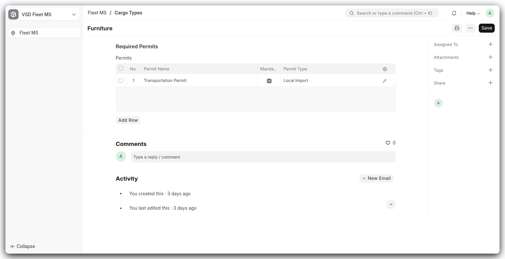
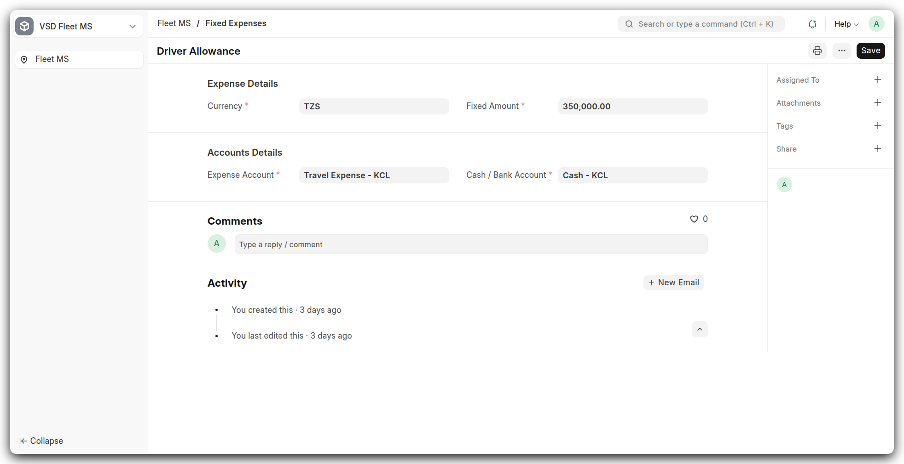

# Configuration: Trips & Settings Doctypes

This section details all configuration-level DocTypes under **Trips** and **Settings**. For each, you’ll find an overview, key fields, and screenshots to guide setup.

---

## �️ Trip Locations

{ width="100%" }

**Overview:**
Defines each physical point used in routes, from depots to border crossings. Essential for mapping and geofencing.

**Key Fields:**

* **Location Name**: Descriptive label.
* **Country**: Linked for regional grouping.
* **Geolocation**: Latitude & longitude for map plotting.
* **Is Local/International Border**: Flags for special handling.

---

## � Trip Location Type

{ width="100%" }

**Overview:**
Categorizes locations by the data you need to capture (arrival, departure, loading, offloading).

**Key Fields:**

* **Location Type**: Unique label (e.g., City, Border Post).
* **Arrival/Departure/Loading/Offloading Date Flags**: Checkboxes to enable date fields per type.

---

## � Trip Routes

{ width="80%" }

**Overview:**  
Defines a named multi‑leg route by linking locations in sequence, then automatically summarizes total distance, fuel use, and fixed costs.

**Key Fields:**

* **Route Name**: Unique identifier for the route.  
* **Starting Point / Ending Point**: Origin and destination links.  
* **Trip Steps** (child table):  
  * **Location** – Waypoint name (e.g., town, border post)  
  * **Distance** – Kilometers from previous step  
  * **Fuel Consumption Qty** – Liters estimated for each leg  
  * **Location Type** – Loading Point, Town, Border Point, Offloading Point, etc.  
* **Total Distance & Total Fuel Consumption Qty**: Read‑only aggregates of all steps.  
* **Fixed Expenses** (child table):  
  * **Expense** – Description (e.g., “Border Charges”)  
  * **Currency** – TZS, USD, etc.  
  * **Amount** – Value per trip  
  * **Party Type** – (Optional) Supplier, Customer, etc.  

---

## � Cargo Types

{ width="100%" }

**Overview:**
Registers cargo categories and any required permits for transport compliance.

**Key Fields:**

* **Name**: Cargo category (e.g., Perishable, Hazardous).
* **Permits**: Table of documentation needed for each type.

---

## � Trip Fixed Expense

{ width="100%" }

**Overview:**
Maintains standard costs associated with trips, such as tolls, permits, or driver allowances.

**Key Fields:**

* **Expense Category**: Label (e.g., Toll, Permit).
* **Amount (Local & USD)**: Specify cost in dual currencies.
* **Linked Route/Trip**: Optionally tie expense to specific routes.

---

## � Truck & Trailer Inspection

{ width="80%" }

**Overview:**
Tracks inspection records for vehicles and trailers to ensure safety and compliance before trips.

**Key Fields:**

* **Inspection Date**: Date of check.
* **Vehicle/Trailer Reference**: Links to Truck or Trailer.
* **Checklist Items**: Table of inspected components and statuses.

---

## ⚙️ Transport Settings

{ width="80%" }

**Overview:**
General configuration for fleet operations, such as default warehouses, cost centers, and notification parameters.

**Key Fields:**

* **Default Fuel Warehouse**: Links to a warehouse record.
* **Default Driver & Vehicle Settings**: Pre-set defaults for new trips.
* **Notification Thresholds**: Define alerts for low fuel, overdue inspections, etc.

---

*With these configurations in place, your Trips module is fully operational. Next, we’ll document the Transaction Doctypes where actual trip data is recorded.*

