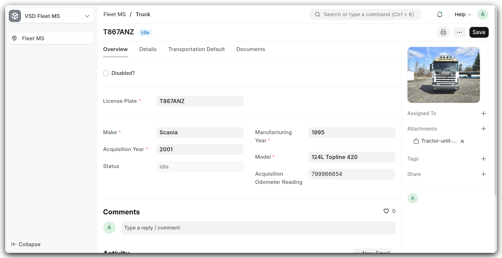
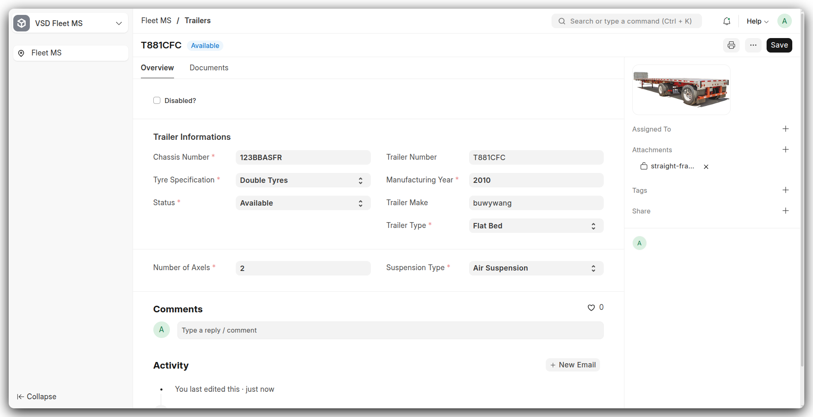
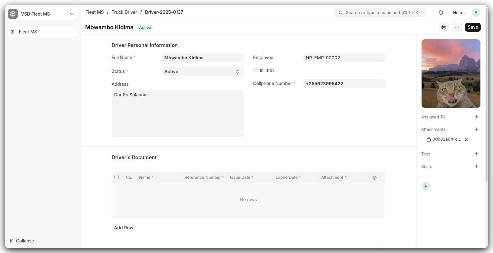

# Setup: Master Doctypes

This section covers the four core Master Doctypes that form the foundation of your VSD Fleet MS setup. For each DocType, you'll find an overview, key fields, and screenshots to guide you through configuration.

---

## 🚚 Truck

{ width="100%" }

**Overview:**
The Truck DocType captures all essential vehicle information, from identifiers to operational status and default settings.

**Key Fields:**

* **Truck Number**: Unique identifier; also drives autonaming.
* **License Plate**: Visible in list views for quick lookup.
* **Make & Model**: Manufacturer data; required for asset tracking.
* **Manufacturing Year & Acquisition Year**: Helps in depreciation and maintenance scheduling.
* **Fuel Type & Fuel UOM**: Defines compatible fuel and unit of measure.
* **Chassis Number & Engine Number**: Critical for compliance and record-keeping.
* **Status**: Workflow state (Idle, On Trip, Under Maintenance, Disabled).

---

## 🚛 Trailer

{ width="100%" }

**Overview:**
The Trailer DocType holds specifications and identification for attached trailers.

**Key Fields:**

* **Plate Number**: Unique and required.
* **Trailer Number**: Custom identifier.
* **Trailer Type & Tyre Specification**: Defines capacity and operational constraints.
* **Number of Axels & Suspension Type**: For load calculations and maintenance.
* **Status**: Indicates availability or maintenance state.
* **Manufacturing Year**: Asset age tracking.

---

## 👤 Truck Driver

{ width="100%" }

**Overview:**
Captures driver profiles and assignment details for operations.

**Key Fields:**

* **Full Name**: Required primary identifier; drives autonaming (`Driver-{YYYY}-{####}`).
* **Status**: Current employment state (Active, Suspended, Left).
* **Cellphone Number**: Unique contact for alerts and dispatch.
* **Address**: Residential or mailing address.
* **Employee**: Link to the Employee record in HR for payroll and records.
* **In Trip?**: Read-only flag indicating if the driver is currently assigned to a trip.
* **Driver’s Document**: Table of attachments (licenses, certifications) to ensure compliance.

---

## ⛽ Fuel UOM

**Overview:**
Defines all fuel measurement units used across transactions.

**Key Fields:**

* **UOM Name**: Unique name (e.g., Liters, Gallons) and drives autonaming.
* **Enabled**: Checkbox to activate or deactivate the unit in the system.

---

*Next up:* In the **Configuration** section, we’ll dive into Trips and Settings doctypes to complete your setup workflow.
